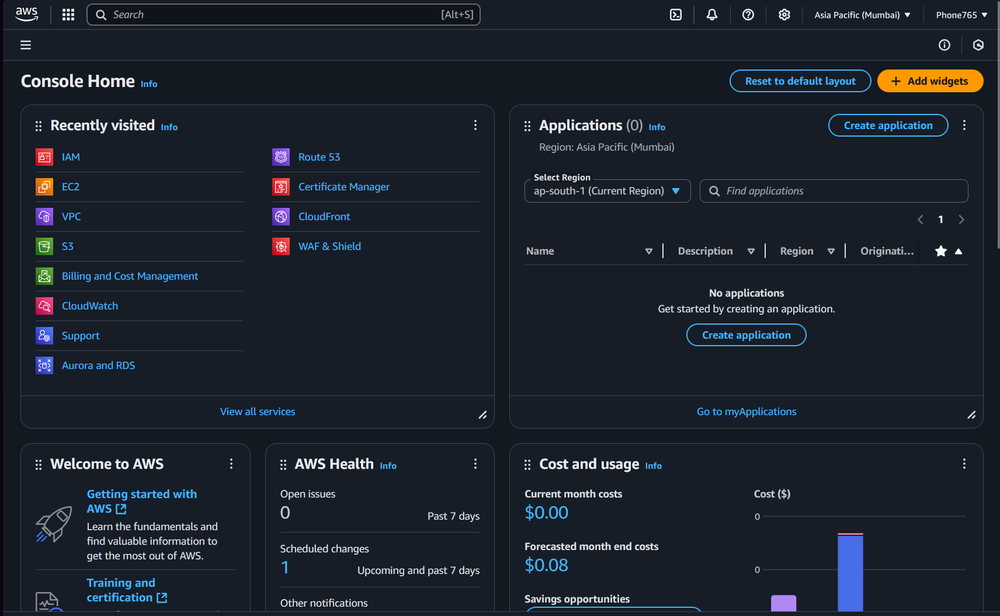
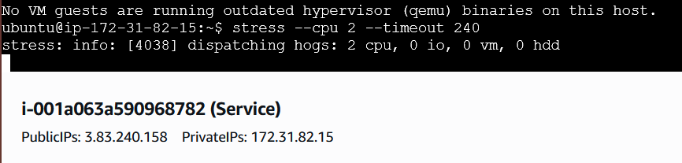
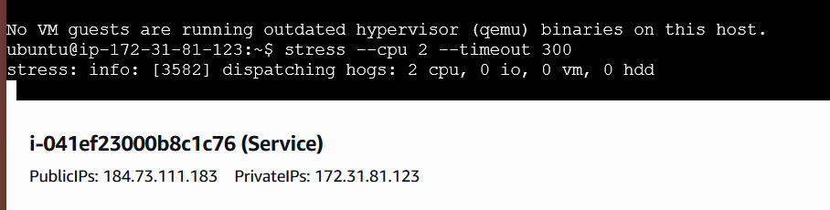
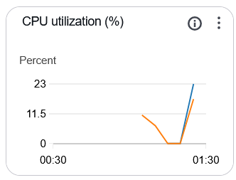
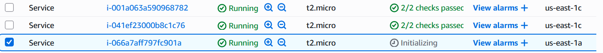

Tìm Hiểu Về AWS

# 1. Overview

- AWS là gì?: Amazon Web Service là giải pháp điện toán đám mây đi kèm với hơn 200 dịch vụ cho doanh nghiệp sử dụng để giảm chi phí duy trì và mở rộng hoạt động.
- Các mô hình cloud computing:
    - Public: Sử dụng 100% phần cứng của bên thứ 3 và truy cập qua internet. Dùng đến đâu trả đến đấy và sử dụng chung nên tàng cùng với các tổ chức khác. Ưu điểm: Không phải lo về cập nhật phần mềm vì chúng sẽ được cập nhật tự động, truy cập dễ dàng miễn là có kết nối với mạng, chi phí sẽ thấp hơn. Nhược Điểm: Giới hạn truy cập một số phần do chỉ đang sử dụng dịch vụ, lo ngại về an ninh do public cloud thường là mục tiêu của các cuộc tấn công mạng.
    - Private: Phần cứng được lắp đặt và duy trì bởi 1 cá thể như công ty hoặc chính phủ. Bảo mật cao hơn và cho phép điều chỉnh cơ sở hạ tầng theo yêu cầu và đảm bảo an toàn thông tin do chỉ nội bộ mới có quyền truy cập. Chi phí đầu tư sẽ cao hơn do cần lắp đặt phần cứng, duy trì phức tạp hơn và đồng bộ với các nền tảng khác sẽ khó hơn do sử dụng phần cứng và phần mêm riêng.
    - Hybrid: Sử dụng hỗn hợp private và public cloud, ví du như dữ liệu được để ở private và mảng public dành cho flexibility và scalability, sử dụng kết hợp cho phép trung chuyển khả năng xử lý dữ liệu, giữ được bảo mật của private nhưng tiết kiệm chi phí nhờ vào public. Lắp đặt và duy trì mô hình hybrid cực kỳ phức tạp do yêu cầu liên kết giữa 2 nền tảng khác nhau, yêu cầu về phần cứng và phần mềm cũng sẽ cao hơn, tích hợp cũng rất phức tạp do sự tương đồng khác nhau.
- Các model Cloud:
    - IaaS: Cung cấp hạ tầng máy tính ảo và tài nguyên qua mạng internet, cho phép người dùng thuê để sử dụng và dùng đến đâu trả đến đấy
    - Paas: Cung cấp môi trường phát triển và triển khai ứng dụng
    - SaaS: Cung cấp phần mềm trực tuyến qua Internet, cho phép người dùng truy cập mà không cần tải ứng dụng về
- AWS price model
    
    Dùng đến đâu thì trả đến đấy và chỉ trả cho những cái mình đã dùng.
    
    dùng càng nhiều thì trả càng ít. 
    
    Giữ chỗ, trả cho một dịch vụ mình sẽ dùng và sẽ phải trả kể cả không dùng nhưng lúc dùng thì sẽ được giảm giá 
    
- Acc AWS:

# 2. Computing Service
- EC2: là cơ sở hạ tầng điện toán đám mây giúp cung cấp tài nguyên máy tính ảo hóa theo yêu cầu sử dụng, các máy tính ảo hóa có thể mở rộng về khả năng xử lý cùng với các thành phần cứng ảo như ram, cpu, và dung lượng, các máy ảo EC2 có thể kết hợp với nhau để đảm bảo tính sẵn sàng và triển khai ứng dụng nhanh nhất có thể.
    - Load Balancing: Phân phối lượng công việc trên các máy chủ
        - HTTP: hoạt động ở layer 7 của OSI model,
        - TCP: hoạt động trên layer 4
        - các thuật toán load balancing:
            - Round Robin: lựa chọn các máy chủ theo tuần tự, load balancer sẽ chọn máy đầu tiên trong danh sách và đi cứ đi vòng liên tục như thế.
            - Least Connections: lựa chọn máy chủ với ít kết nối nhất
            - Least Respond Time: Lựa chọn máy chủ có thời gian đáp ứng nhanh nhất dựa trên thời gian đáp trung bình của từng máy chủ
            - IP Hash: dựa trên địa chỉ IP của client để điều phối yêu cầu tới cùng 1 máy chủ đảm bảo yêu cầu của client sẽ được xử lý bởi một máy chủ trong 1 phiên làm việc
            - URL Hash: tương tự như IP nhưng sử dụng URL
            - Weighted Round Robin: biến thể của Round robin, mỗi máy chủ dc gán một trọng số khác nhau dựa trên năng lực xử lý
            - Least Loaded: Gửi yêu cầu đến máy chủ có trọng tải thấp nhất tại thời điểm hiện tại, dựa trên các chỉ số như clockrate, used memory,…
- EC2 Autoscaling: Tự động tăng giảm các instances EC2 nhẳm đảm bảo có đủ tài nguyên để đáp ứng với yêu cầu kết nối và khả năng hoạt động trong trường hợp có instance bị lỗi. Đồng thời giám sát độ ổn định của các máy ảo và tự động khởi động lại trong trường hợp phát hiện lỗi, cho phép cập nhật phần mềm cho các trường hợp đang chạy đồng đều.Cần phải có Autoscaling để đảm sự ổn định và hoạt động của ứng dụng cùng với sự đồng đều giữa các trường hợp, auto scaling giúp tăng tự động hóa của ứng dụng và khả năng vận hành 24/7 mà không cần sự can thiệp.
        - Có 2 kiểu Autoscaling:
            - Horizontal: tạo thêm các phiên bản dựa trên yêu cầu sử dụng và phân bổ công việc đồng đều cho các phiên bản tạo thêm
            - Vertical: Tăng khả năng xử lý của 1 phiên bản để có thể đáp ứng yêu cầu
# 3. Event Service
- Message Queue: Là phần mềm trung gian cho phép gửi tin nhắn cho các ứng dụng dưới hình thức publisher và subscriber, nhận tin nhắn dưới dạng cơ bản (text,xml,json) và gửi đi, Message Queue tuân thủ theo FIFO - First In First Out, tin đầu tiên vào sẽ luôn là tin đầu tiên được gửi đi.
- Message Broker: Một phiên bản nâng cao hơn của Message Queue, cho khả năng phiên dịch tin nhắn để các ứng dụng chạy bằng code khác nhau hoặc các nền tảng khác nhau đều nhận được tin. Message Broker cũng có thêm các tính năng nhằm giúp tối ưu khả năng đưa tin đảm bảo rồi người nhận sẽ nhận được tin.Là phần mềm trung gian, message broker cho phép người gửi gửi mà không cần biết người nhận là ai, có đang hoạt động không hay có bao nhiêu người nhận.
- SNS: Dịch vụ thông báo nhanh, cho phép gửi tin nhắn riêng lẻ hoặc hàng loạt tới số lượng lớn người nhận, gửi tin nhắn đến email, thiết bị di động, đến cả các dịch phụ phân tán tin nhắn khác. hoạt động theo hình thức theo dõi công khai (Publisher - Subscriber)
- SQS: Hệ thống sắp xếp phân tán, tin không được gửi trực tiếp đến người nhận mà người nhận phải đi thăm dò SQS để tìm tin nhắn đấy, ai cũng có thể nhận, xử lý và xóa tin nhắn. Chỉ có thể sử dụng được nếu tất cả người dùng y hệt nhau.
- Ngoài SNS và SQS, người dùng có thể chọn các dịch vụ khác như Apache Kafka hoặc RabbitMQ
- EventBridge: Dịch vụ không máy chủ cho phép giao tiếp không đồng bộ giữa các dịch vụ của AWS và phần mềm của bên thứ 3. Giao tiếp dựa trên các sự kiện, khi mà dịch vụ nguồn tạo ra sự kiện, EventBridge sẽ đảm sẽ đảm nhiệm sự kiện đấy và đảm bảo đối tượng mà sự kiện cần được thông báo đến sẽ nhận được tin.
# 4. Network service
- VPC: Cho phép người dùng tạo Private Cloud trong cơ sở hạ tầng của Public Cloud. Đảm bảo sự bảo mật của dữ liệu khách hàng, ngăn chặn truy cập trái phép bằng nhiều biện pháp bảo mật như subnet, VLAN và VPN, những biện pháp này chỉ được phân bổ cho riêng từng khách hàng, đảm bảo rằng không có bên nào từ public có thể truy cập được dữ liệu trên VPC.
- Subnet (mạng con): giúp tối ưu hệ thống mạng, giúp các packet đi thẳng đến người nhận thay vì phải đi qua nhưng router không cần thiết.
- NAT Gateway: cho phép tài nguyên trong private subnet kết nối với các dịch vụ bên ngoài và internet nhưng đồng thời không cho phép tất cả các dịch vụ không nằm trong private subnet giao tiếp với chúng. Nếu để Public thì private subnet có thể có kết nối với internet nhưng ko thể nhận kết nào, còn Private thì chỉ cho giao tiếp giữa các VPC nhưng chỉ là đầu đi chứ không được đầu về
- Direct connect: dịch vụ đường truyển trực tiếp của AWS mà không cần đi qua nhà cung cấp internet, cho phép người dùng truyền một số lượng dữ liệu lớn từ dịch vụ khác lên AWS thông qua các Virtual Interface. Direct Connect hỗ trợ người dùng các cơ hạ tầng hybrid và những trường hợp cần sử dụng các ứng dụng trong real time.
- Route 53: Có thể hiểu đơn giản là một công cụ giúp chuyển tiếp từ tên miền (Domain Name) sane IP Address để giao tiếp qua internet, Route 53 đồng thời cũng liên tục giám sát tình trạng của tài nguyên, đảm bảo rằng người dùng luôn có thể truy cập được tài nguyên cần thiết bằng cách điều hướng sang tài nguyên khác nguyên vẹn.Route 53 cũng giúp đăng ký tên miền cho trang web của người dùng. các Routing Policies của Route 53:
    - Simple Routing Policy: thủ thuất routing đơn giản giúp điều hướng lưu lượng truy cấp đến tài nguyên
    - Failover Routing Policy: điều hướng truy cập từ tài nguyên bị lỗi sang tài nguyên bình thường
    - Geolocation Routing Policy: Điều hướng truy cập dựa trên vị trí địa lý của người dùng, dẫn họ đến trang web ở nước của mình
    - Geoproximity Routing Policy: Điều hướng truy cập dựa trên vị trí địa lý và loại nội dung mà người dùng muốn truy cập.
    - Latency Routing Policy: Nếu trang Web được host ở nhiều vùng, thì hệ thống sẽ tự động chọn vùng có độ trễ thấp nhất từ vị trí người dùng.
    - Multivalue Routing Policy: Route 53 sẽ trả nhiều value sau yêu cầu DNS queries.
    - Weighted Routing Policy: điều hướng truy cập đến nhiều tài nguyên với một tên miền duy nhất dựa theo thiết lập của người dùng
# 5. Assignment

a. Mini Http service

sử dụng flask để viết một mini service. Các câu lệnh sử dụng để cài:

sudo apt update

sudo apt install python3

sudo apt install python3-pip

sudo apt install python3-flask

nano app.py

sudo python3 app.py

sau khi cài đặt thì sẽ kết với IP của instance để kiểm tra hoạt động chưa, trong lúc cài EC2 thì phải đảm bảo cho phép http port 80 để có thể kết nối. (http://ip-address/)

b & c.

tạo 2 instances rồi thiết lật target group cho 2 instances đấy, qua port 80. thiết lập load balancer cho 2 instances sử dụng target group.

thiết liệt auto balancer và chọn auto balance cùng với load balancer, thiết lập min 1 và max 4 với desired instances là 2, cài đặt thêm tracking policy là average CPU usage với mức là 50. Sau khi cài đặt xong auto balancer thì vào instances và cài thêm stress bằng lệnh sudo apt install stress. Sau khi cài thì kích hoạt stress bằng câu lệnh stress —cpu 2 —timeout (tgian chạy) ở 2 instances, sau 1-2p thì auto scaling sẽ phát hiện mức sử dụng cpu cao và tăng thêm instances bằng template và sau khi auto scaling phát hiện thấy mức sử dụng cpu giảm và thời gian chờ 60s đã trôi qua sẽ tự động giảm số lượng instances xuống desired.

