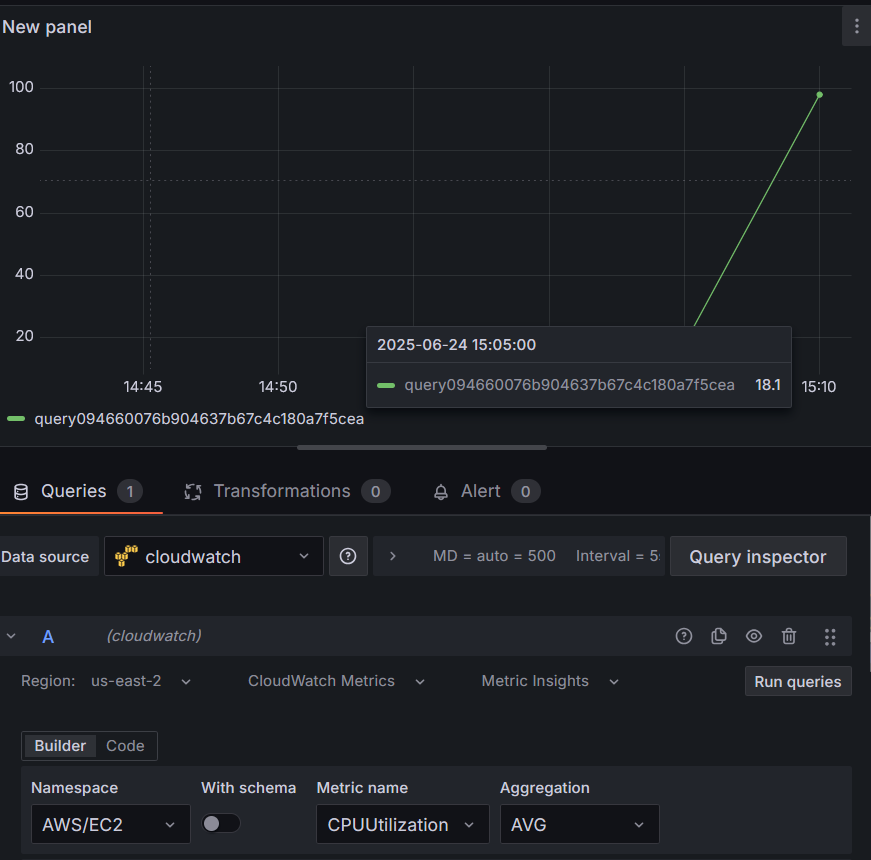
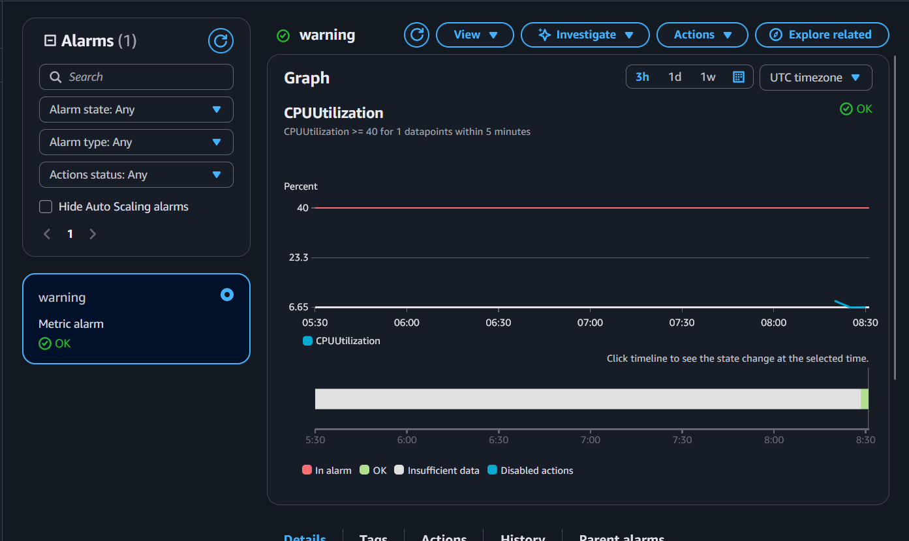
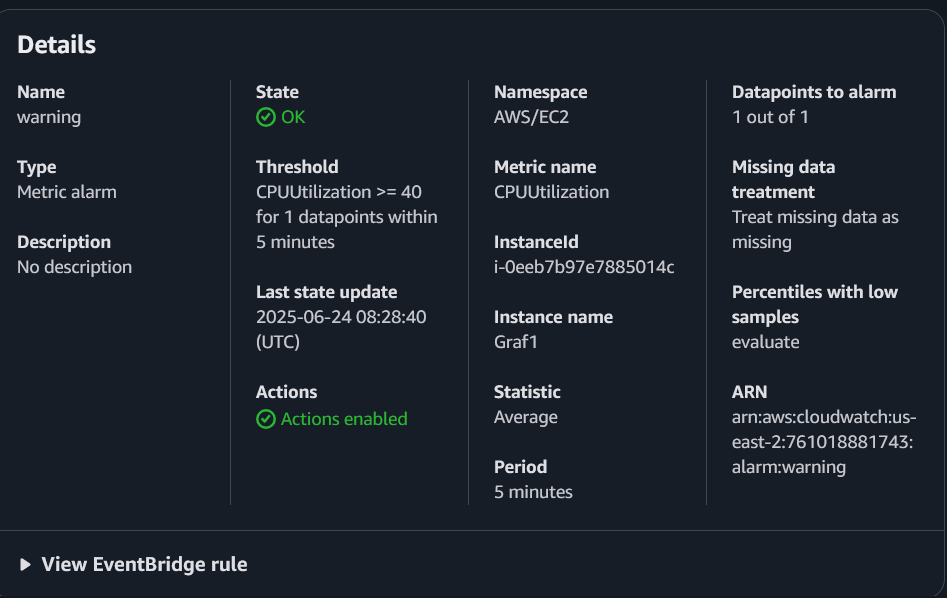
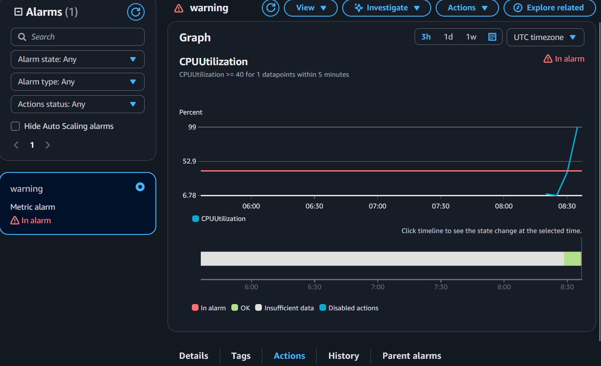
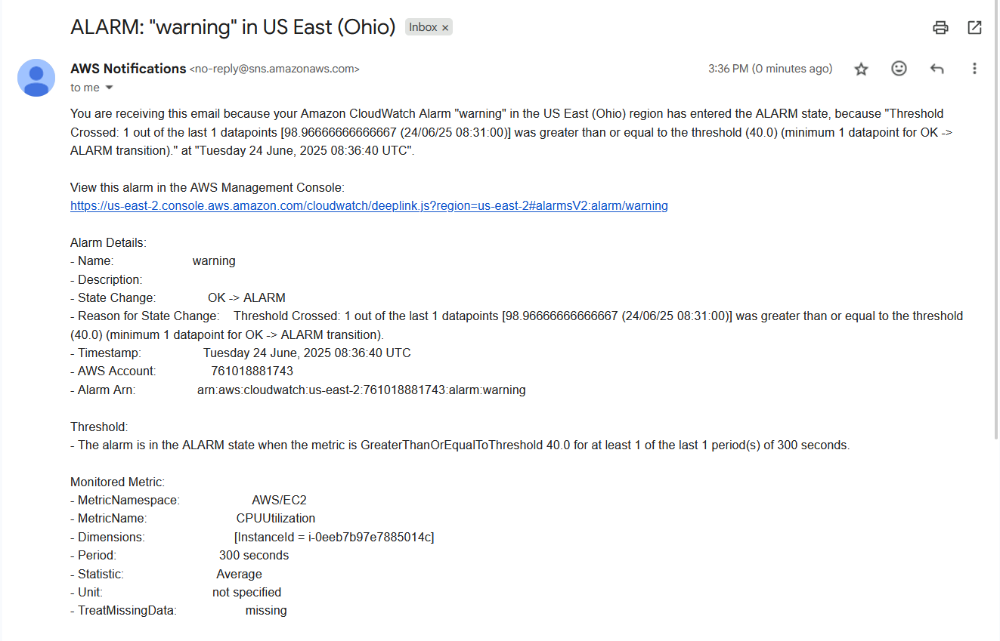

1. Security Service
- MFA: Multi-factor authentication, Là một lớp bảo mật nữa nằm ở trên mật khẩu thông thường nhằm phòng chống truy cập trái phép bằng cách yêu cầu khóa vật lý cắm vào máy tính để xác minh người dùng, mật mã bảo mật dùng một lần hoặc tin nhắn/mail xác thực.
- IAM: Identity and Access Management, kiểm soát quyền truy cập của người dùng. Cho phép tạo cách danh tính để các thành viên khác có thể truy cập đúng tài nguyên mình cần trong hệ thống. Dịch vụ này cũng kiểm soát và giám sát truy cập của người dùng, mỗi lần có người dùng muốn truy cập một dịch vụ, IAM sẽ kiểm tra xem người dùng đó có trong danh sách cho phép không và chấp nhận yêu cầu truy cập của người dùng.
    - Security Group: tưởng lửa ảo kiểm soát quyền truy cập của các instances. Inbound rule cho phép  các traffice truy cập theo điều kiện đưa ra, vd source, protocol, port range. Outbound rule, cho phép instance gửi thông tin ra ngoài, hoạt động dựa trên điều kiện đặt ra tương tự như inbound rule, vd Destination, protocol và port range. SG hoạt động theo hướng stateful, một khi đã truy cập vào instance được thì sẽ cho phép phản hồi request mà không ảnh hưởng tới outbound rule
2. Storage & CDN Service
- EBS: là dịch vụ lữu trữ dạng block dễ sử dụng và có hiệu năng cao, được thiết kế để dùng chung với EC2.
    - Amazon EBS general purpose SSD volumes - GP2/GP3: cả 2 đều có độ bền là 99.8%-99.9% tức tỉ lệ hỏng 0.1%-0.2%.Thích hợp để dùng cho các công việc giao dịch, máy ảo, Database size trung , các ứng dụng cần độ trễ thất,… . dung lượng tối đa là 1 GiB - 16GiB
    - Amazon EBS Provisioned IOPS SSD volumes: io1/io2 Block Express, io1 có độ bền như gp2/3 nhưng io2 thì lại có độ bền là 99.999%. Tối ưu cho hiệu năng, phù hợp với các ứng dụng kinh doanh quan trọng cần hiệu năng IOPS bền vững. io1 có dung lượng 4GB - 16TB. io2 Block Express 4GB - 64TB, có độ trễ dưới mili giây
    - Throughput Optimized HDD volumes
    - Cold HDD volumes
        - sử dụng ổ đĩa từ với mục địch là tối ưu dung lượng ra vào thay vì số operation hoặc một lưu lượng dung lượng lớn và cho các loại các dữ liệu ít được truy cập nhưng vẫn cần lưu giữ.
    - *Phân biệt IOPS và throughput: IOPS (Input/Output Operation Per Second) đo số lượng OPERATION mà thiết bị lưu trữ có thể làm trong 1 giây còn throughput đo số lượng dữ liệu mà thiết bị lữu trữ có thể đọc và viết thông bits hoặc byte
- EFS - Amazon Elastic File System : lưu trữ đa dụng có khả năng tăng giảm tự động theo yêu cầu sử dụng lên đến petabytes, giao diện đơn giản cùng với tự động phân bổ dung lượng cho người dùng kéo thả file đơn giản và nhanh chóng. Chạy theo protocol Network File System version 4 (NFSv4.1)
    - EFS Case study:
- S3 :  dịch vụ lữu trữ thiết kế cho dung lượng lớn, giá rẻ phân chia qua nhiều vùng nhằm đảm bảo độ bền và khả năng mở rộng của dữ liệu. S3 đảm bảo an toàn cho dữ liệu của người dùng bằng cách mã hóa dữ liệu client side hoặc server side, S3 cũng duy trì nhiều bản copy của dữ liệu để dễ dàng phục hồi dữ liệu trong trường hợp hỏng,S3 có 3 lớp lữu trữ:
    - S3 standard truy cập dữ liệu thường xuyên: Thích hợp cho môi trường nhạy cảm với hiệu suất và yêu cầu đỗ trễ thấp
    - S3 standard truy cập dữ liệu không thường xuyên: thích hợp cho môi trường lữu trữ dữ liệu lâu dài và ít được truy cập thường xuyên nhưng vẫn cần hiệu suất cao
    - S3 Glacier: phù hợp với lưu trữ lâu dài mà không cần hiệu suất
    - S3 policy: Điều chỉnh khả năng truy cập của người dùng và giới hạn tính năng như read-only hoặc cho phép 1 hoặc nhiều người tải file lên S3
    - S3 tích hợp IAM
- CloudFront
    - CDN - Content Delivery Network : là mạng phân phối nội dung một nhóm server được đặt tại các vị trí khác nhau để trải dài mạng lưới nội dung ở nhiều vị trí địa lý khác nhau. Dịch vụ CDN của AWS có tên là CloudFront và phục vụ cung cấp giữ liệu qua các trung tâm mạng lưới dữ liệu trên toàn thế giới được gọi là edge location, hiện tại các trung tâm này được đặt 65 thành phố trên 29 quốc gia cụ thể là có 155 edge locations.
    - Case Study
3. Database Service
- RDS - Relational DataBase Service: Dịch vụ quản lý cho phép triển khai và quản lý cơ sở dữ liệu trên AWS, được thiết kế cho xử lý giao dịch trực tuyến (OLPT) và phù hợp nhất với các yêu cầu lưu trữ dữ liệu có cấu trúc và quan hệ.
    - Amazon Aurora:
    
    **Amazon Aurora** là một cơ sở dữ liệu quan hệ do Amazon cung cấp, được quản lý hoàn toàn qua dịch vụ Amazon RDS. Nó **tương thích với MySQL và PostgreSQL**, cung cấp hiệu suất cao (nhanh gấp 5 lần MySQL và 3 lần PostgreSQL tiêu chuẩn) với **chi phí thấp hơn 1/10** so với các hệ thống thương mại.
    
    ### Các điểm nổi bật:
    
    - **Hiệu suất & Mở rộng**: Tự động mở rộng đến 64TB, hỗ trợ tới 15 bản sao đọc, tối đa 32 vCPU và 244GB RAM.
    - **Khả dụng & Bảo mật cao**: Đảm bảo 99.99% uptime, sao lưu liên tục, bảo vệ dữ liệu bằng mã hóa và nhân bản tại 3 vùng khả dụng.
    - **Tương thích**: Hỗ trợ đầy đủ các công cụ và ứng dụng hiện dùng với MySQL/PostgreSQL. Hỗ trợ Fast Insert tăng hiệu năng.
    - **Quản lý tự động**: Tự động hóa việc sao lưu, vá lỗi, và theo dõi hiệu suất qua Amazon CloudWatch, Performance Insights.
    
    Bạn có thể dễ dàng di chuyển cơ sở dữ liệu từ MySQL/PostgreSQL sang Aurora chỉ với vài thao tác trong RDS Console.
    
     (AI tóm gọn do dài quá)
    
    - AuroraDB: Cơ sở dữ liệu quan hệ được cung cấp bởi Amazon, được quản lý đầy đủ, tương thích với MySQL và PostgreSQL và được xây dựng cho cloud, tích hợp hiệu suất và tính khả dụng của các cơ sở dữ liệu thương mại với tính đơn giản và hiệu quả của cơ sở dữ liệu có mã nguồn mở, tất cả các công cụ trên MySQL và PostgreSQL đều có trên Aurora.
    - MySQL: cơ sở dữ liệu mã nguồn mở, linh hoạt với nhiều ứng dụng, có một cộng đồng hỗ trợ đông đảo và sự tương thích với các ứng dụng.
        - Ưu điểm
            - dễ dàng di cư dữ liệu từ các cơ sở dữ liệu MySQL có sẵn
            - tương thích với nhiều ứng dụng và công cụ
            - được phát triển và lưu trữ bởi cộng đồng người dùng
            - tối ưu chi phí cho khối lượng công việc từ nhỏ đến trung
        - Nhược điểm
            - hiêu năng và mở rộng kém hơn Aurora MySQl
            - hạn chế về parallel query
            - tốc độ sao lưu, phục hồi, chuyển đổi dự phòng kém hơn Aurora
    - MariaDB: Phiên nâng cấp của MySQL được phát triển bởi cộng đồng với sự tập trung vào hiệu năng và sự linh hoạt
        - Ưu điểm
            - Tương thích cao với MySQL
            - hỗ trợ thread pooling và cache tốt hơn
            - được phát triển hoàn toàn bởi cộng đồng người dùng
        - Nhược điểm
            - hệ sinh thái nhỏ hơn MySQL và PostgreSQL
            - không tương thích hoàn toàn với MySQL
            - ít công cụ doanh nghiệp hơn
    - Oracle: Cơ sở dữ liệu dành cho doanh nghiệp với các tính năng nâng cao và hiệu năng cao
        - Ưu điểm
            - hiệu năng cao, ổn định và có khả năng mở rộng tốt
            - nhiều tính năng nâng cao (bảo mật nâng cao, phân tích và phân chia dung lượng)
            - thích hợp cho các ứng dụng doanh nghiệp
        - Nhược điểm
            - Chi phí cao do phí cấp quyền sử dụng
            - phụ thuộc vào hệ sinh thái của Oracle
            - khó học cho người dùng mới
    - SQL Server: Cơ sở dữ liệu dành cho doanh nghiệp của Microsoft, dành cho các môi trường sử dụng Window.
        - Ưu điểm
            - tương thích cao với các công cụ của Microsoft
            - hỗ trợ các công cụ phân tích, báo cáo như SSIS, SSRS
            - thích hợp cho hệ thống OLTP và OLAP doanh nghiệp
        - Nhược điểm
            - chi phí bản quyền cao
            - bị hạn chế trong các môi trường không phải Window
            - ít linh hoạt hơn các cơ sở dữ liệu mã nguồn mở
    - PostgreSQL: Cơ sở dữ liệu mã nguồn mở với nhiều tính năng cao cấp, phù hợp cho truy vấn phức tạp
        - Ưu điểm
            - hỗ trợ nhiều tính năng nâng cao (JSONB, full-text search,…)
            - tuân thủ tiêu chuẩn và nhất quán dữ liệu tốt
            - hệ sinh thái phong phú với nhiều extension
            - phù hợp cho các ứng dụng phân tích dữ liệu
        - Nhược điểm
            - tốc độ giảm với các công việc write nhiều
            - các extensions có thể không tương thích với mọi phiên bản
            - điều chỉnh để tối ưu hiệu năng khó hơn MySQL
    
    Chi phí sử dụng các Database engine:
    
    | Database Engine | Instace price | Storage Price | Other & Extra cost |
    | --- | --- | --- | --- |
    | MySQL | ~$0.0416/hr → ~$30.00/month | ~$0.10/GB/month | Backups: First DB-size free |
    | PostgreSQL | ~$0.0416/hr → ~$30.00/month | ~$0.10/GB/month | Backups: First DB-size free |
    | MariaDB | ~$0.0416/hr → ~$30.00/month | ~$0.10/GB/month | Backups: First DB-size free |
    | Oracle SE2 | ~$0.092/hr → ~$66.24/month | ~$0.10/GB/month | Pay for Multi-AZ separately |
    | Aurora MySQL | ~$0.10/hr → ~$72/month | ~$0.10/GB/month | I/O charges: ~$0.20/million requests |
    | Aurora PostgreSQL | ~$0.10/hr → ~$72/month | ~$0.10/GB/month | I/O charges: ~$0.20/million requests |
    | SQL server Std | ~$0.15–0.17/hr → ~$110–125/month | ~$0.10/GB/month | SSRS, SSIS cost extra |
    | SQL server Web | ~$0.069/hr → ~$50/month | ~$0.10/GB/month | Higher with Enterprise |
- Elastic Cache: hoạt động tương tự như cách RDS được sử dụng để cung cấp dịch vụ cơ sở dữ liệu, cho phép người dùng thuê các in-memory storage như Redis hay Memcached, ElasticCache giúp giảm áp lực lên cơ sở dữ liệu khi phải xử lý nhiều cũng như không cần lưu trữ các giá trị không cần thiết, đồng thời do được triển khai bởi AWS nên ElasticCache cũng có các lợi ích sau:
    - Stateless: Phần lớn các dịch vụ được quản lý bởi AWS nhìn chung hiếm gặp tình trạng bị sập bất ngờ dẫn đến mất dữ liệu lưu trữ, ngoài ra nó còn cho phép nhiều thiết bị, instances khác nhau truy cập. Cho nên khi một instance sập hoặc nếu request của người dùng được điều phối đến các instances khác nhau, hệ thống vẫn có thể đáp ứng các request này.
    - Amazon quản lý: Do được amazon quản lý nên người dùng sẽ không phải lo về OS maintenance/patching, cấu hình, tối ưu hóa,… giúp tiết kiệm rất nhiều thời gian và công sức.
    - Cân nhắc về chi phí và code change: cần phải quản lý chặt chẽ đồng thời thiết lập các chiến lược lưu trữ hiệu quả để tối ưu chi phí, tránh các chi phi phát sinh không cần thiết. Việc sử dụng ElasticCache cũng sẽ phực tạp hơn các cơ chê Cache local
- NoSQL: một loại cơ sở dữ liệu không sử dụng ngôn ngữ SQL để truy vấn. Được phát triển từ yêu cầu cần những cơ sở dữ liệu có khả năng lưu trữ và truy vấn dữ liệu với tốc độ cao mà không yêu cầu năng lực quá lớn từ phần cứng, tài nguyên hệ thống và tăng khả năng chịu lỗi. Các lợi thế của NoSQL:
    - High Scalability: Gần như không có giới hạn cho dữ liệu và số lượng người dùng trên hê thống.
    - High Availability: Do chấp nhận sự trùng lập trong lữu chữ nên nếu một node sập thì thì cũng không ảnh hưởng tới toàn hệ thống
    - Atomicity: Độc lập data state trong các operation
    - Consistency: chấp nhận tính nhất quán yếu, có thể không thấy ngay được sự thay đổi khi cập nhật dữ liệu.
    - Durability: Dữ liệu tồn tại trong bộ nhớ máy tính nhưng đồng thời cũng được lưu trữ trong ổ đĩa cứng
    - Deployment Flexibility: Việc bổ sung và loại bỏ các node sẽ được hệ thống tự động nhận biết để lữu trữ mà không cần phải can thiệp trực tiếp. Hệ thống không đòi hỏi phần cứng mạnh và sự đồng nhất
    - Modeling Flexibility: Key-Value pairs, Hierarchical data, Graph
    - Query Flexibility: Multi-gets, Range queries
- DynamoDB: Dịch vụ quản lý NoSQL của Amazon có khả năng đáp ứng hiệu suất cao và nhanh kèm theo khả năng mở rộng. DynamoDB tự động phân tán dữ liệu và traffic của một bảng ra một số lượng server vừa đủ để có thể xử lý request capacity đặt ra bởi khách hàng và lượng dữ liệu lưu trữ và đồng thời đảm bảo hiệu suất nhanh nhất và đồng nhất. Tất cả dữ liệu được lưu dữ và sao chép ra các vùng sẵn sàng (availability zone) trong 1 khu vực (region) để cùng cấp độ sẵn sàng cao và độ bền của dữ liệu (high availability and data durability)
- Ngoài DynamoDB, nếu người dùng không muốn bị gò bó vào sử dụng hệ sinh thái của Amazon và có giới hạn về chi phí thì có thể chuyển sang sự dụng NoSQL dưới dạng OSS (Open-source Software), như:
    - Apache Cassandra: cơ sở dữ liệu hiệu năng cao v
    - Apache Hbase
    - MongoDB
    - Neo4j
    - Apache CouchDB
- Chi phí sử dụng DynamoDB
    - Read and write Request
        - DynamoDB standard Request
            - WRU (Write request unit): $0.625/1 triệu đơn vị
            - RRU (Read request unit): $0.125/1 triệu đơn vị
        - DynamoDB standard infrequent access:
            - WRU: $0.78/1 triệu đơn vị
            - RRU: $0.155/1 triệu đơn vị
    - Data Storage
        - DynamoDB standard
            - 25GB đầu tiên miễn phí hàng tháng
            - $0.25 cho mỗi GB sau đấy
        - DynamoDB Standard-Infrequent Access
            - $0.10 mỗi tháng
    - Backup and Restore
        - Continuos Backup
            - 0.20$ mỗi GB hàng tháng
    - Global Table
        - DynamoDB Standard
            - Replicated write request unit $0.625/1 triệu đơn vị
        - DynamoDB Standard-Infrequent Access
            - Replicated write request unit $0.780/1 triệu đơn vị
    - Change Data capture for Amazon Kinesis Data Streams
        - $0.10/1 triệu đơn vị
    - Warm Throughput
        - TBA
    - Change Data capture for AWS glue
        - $0.10/1 triệu đơn vị
    - Xuất Data sang S3
        - Full Export to S3
            - $0.10 mỗi GB
        - Incremental Export to S3
            - $0.10 mỗi GB
    - Data nhập sang từ S3
        - $0.15 mỗi GB
    - Tích hợp với DyanmoDB Accelerator (DAX)
        - Phí phải trả sẽ dựa trên vCPU mà người dùng chọn, trong trường hợp này sẽ giả sử người dùng chọn vCPU DAX dax.r7i.2xlarge thì phí sẽ là
            - $1.017 mỗi giờ
    - DynamoDB Stream
        - Hàng tháng, 2,500,000 yêu cầu đọc DynamoDB Stream đầu tiên được miễn phí
        - $0.02/100,000 yêu cầu đọc DynamoDB Stream sau đấy
4. Container Service
- ECS (Elastic Container Service): Là service quản lý và điều phối container được phát triển bởi Amazon có hỗ trợ Docker. Dịch vụ này cho phép người dùng dễ dàng triển khai, quản lý và tự động điều chỉnh quy mô các ứng dụng chạy trong các bộ chứa. Cho phép người dùng launch hoặc stop container-based thông API đồng thời cho phép lấy state của các cluster từ centralized server cũng như cho phép access tới các features giống EC2.
- ECS vs EC2 + Container: ECS là dịch vự được quản lý bởi amazon và được tích hợp rất nhiều service để giúp deploy cluster đơn giản hơn, trong khi đó EC2 sẽ chỉ cung cấp cho người dùng máy ảo, tất cả các utility và service sẽ do người dùng tự chọn, tự cài và tự deploy. Nhưng 2 service này không hẳn là khác nhau hoàn toàn, ECS là một service điều phối và đối tượng của nó sẽ là các instances EC2 với Docker, EC2 với container có thể chạy mà không cần ECS nhưng ECS không thể chạy mà không có EC2 nhưng điều này đã được thay đổi nhờ vào sự ra mắt của Fargate.
- Combine ECS with ECR & S3 (TBA)
    - EKS: Được phát triển bởi Amazon dựa trên Kubernetes, nguyên lý hoạt động gần như y hệt k8s nhưng sẽ có một vài sự khác biệt. trong cluster thì EKS sẽ là control plane cho các node và cho phép người dùng quản lý tài nguyên qua giao diện của AWS, EKS đã được tích hợp sẵn rất nhiều các dịch vụ của AWS để hỗ trợ quản lý. Worker node của EKS có 3 loại
        - Self-managed node: tạo thủ công và joing vào cluster qua Node Group, là các instance EC2 cùng instance type, AMI và cùng EKS Node Role
        - EKS managed node: do EKS quản lý và sẽ tự động autoscale để điểu chỉnh số node
        - Fargate: tự tạo phần resource đáp ứng với nhu cầu mà không quan tâm đến node, các resource này không thể được truy cập trực tiếp vào.
5. Logging và Monitoring Services
- CloudWatch: Là một dịch vự được AWS cung cấp để theo dõi các tài nguyên sử dụng chỉ với một console, CloudWatch cho phép theo dõi, lưu trữ và khả năng truy xuất vào các file logs của hệ thống và ứng dụng, cung cấp báo cáo phân tích trend và hiệu suất hệ thống, cung cấp các công cụ thông báo khi có thay đổi hoặc lỗi trong các tài nguyên. Cách CloudWatch hoạt động:
    - Metric: biểu thị một tập hợp các datapoint được sắp xếp theo thời gian cung cấp cho CloudWatch. Một metric có thể hiểu như một biến để theo dõi và các data point đại diện cho giá trị của biến đó theo thời gian
    - Dimension: là một cặp key/value xác định tính độc nhất của một metric, dùng để miêu tả đặc điểm và tính chất của metric. Mỗi Dimension được cloud watch coi là một metric riêng cho dù chúng có tên giống nhau.
    - Statistic: là dữ liệu của một metric được thu nhập trong một khoảng thời gian cụ thể. Những thống kê này được cung cấp dựa trên data point của metric được cung cấp bởi các dịch vụ của AWS tới CloudWatch. Việc tổng hợp dựa vào namespace, tên metric và đơn vị đo lường của data point trong khoảng thời gian mà người dùng đặt.
    - Alarm: một dịch vụ theo dõi metric của CloudWatch và tự động gửi thông báo đến cho người dùng khi metric mà nó đang theo dõi có biến đổi thông qua SNS hoặc do người dùng cài đặt.
- Phí sử dụng CloudWatch
    - Metrics
        - Basic: miễn phí
        - Custom(standard resolution): $0,30/metric/tháng
        - Custom (high resolution): $0,30/metric/tháng + $0,01/1 triệu API call
    - Logs
        - Ingestion: $0,50/GB
        - Storage: $0,03/GB/tháng
        - Insight Queries: $0,005/GB quét
    - Dashboard
        - 3 dashboard đầu tiên: miễn phí
        - các dash board sau đấy: $3,00/dashboard/tháng
    - Alarms
        - standard(1 phút): $0,10/thông báo/tháng
        - high-resolution (10s): $0,30/thông báo/tháng
    - Events
        - Events published/matched: $1,00/1 triệu sự kiện
- CloudTrail: Là dịch vụ cho admin theo dõi các hoạt động, quản lý, tuân thủ và đánh giá rủi ro cho tài khoản AWS. Tất cả các action của từng người dùng, role hoặc AWS sẽ được lưu lại thành nhiều events trong CloudTrail với thời gian lưu trữ là 90 ngày. Các events được do CloudTrails bắt được sẽ được lưu trữ trong S3, nhưng gần đây amazon đã ra mắt CloudTrail Lake dùng để lưu trữ events của CloudTrail.
- AWS Opensearch: là một công cụ tìm kiếm va phân tích phân tán, hướng tới cộng đồng với mã nguồn mở được cấp phép bởi Apache 2.0, được sử dụng cho các trường hợp như giám sát ứng dụng theo thời gian thực, phân tích bảng ghi và tìm kiếm trang web. Cách đẩy log lên Opensearch.
    - đầu tiên application sẽ tạo log, những log này sẽ được một log collector ví dụ như FluentBit thu thập và gửi lên data prepper
    - Data Prepper là công cụ của opensearch, dùng để biến đổi, bình thường hóa và giúp chuyển biến dữ liệu với mục đích phân tích downstream và minh họa. Sau khi log được thu thập, thì phần mềm log collector sẽ đẩy logs lên Data Prepper để biến đổi sang dạng có cấu trúc và đẩy lên Opensearch cluster
    - giữ liệu trên Opensearch có thể được xem bằng queries search hoặc trang khám phá trên dashboard của Opensearch.
- Billing Cost Explorer: là một dụng cụ phân tích giúp người dùng thấy được trend của phí sử dụng và giúp đưa ra chi phí dự tính cho 12 tháng tiếp theo dựa trên dữ liệu từ 13 tháng trở lại và dữ liệu của tháng hiện tại, mục đích của Cost Explorer là giúp người dùng tối ưu chi phí sử dụng cho cơ sở hạ tầng qua dữ liệu của các tháng trước đấy với giao diện dễ nhìn.
    - tích hợp cost explorer với cảnh báo billing qua email:
6. Demo Monitoring + Billing Alert
-Grafana Dashboard:

- Cloudwatch Dashboard & Metric:

