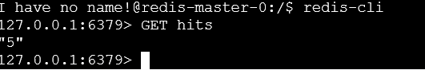
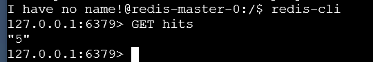
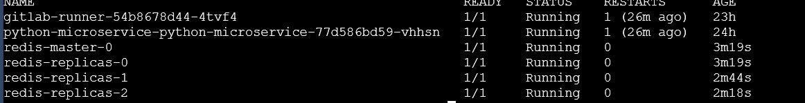
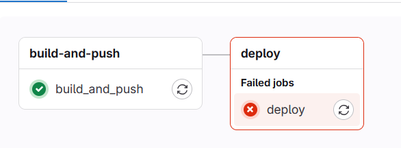

1. Helm là gì?
    
    Helm là trình quản lý gói và công cụ quản lý úng dụng cho kubernetes, đóng gói nhiều tài nguyên kubernetes vào một đơn vị triển khai logic duy nhất được gọi là charts, bên trong của charts sẽ là templates, định nghĩa tài nguyên để triển khai lên k8s.
    
2. Install guide:
    
    Target: chạy được microservice đơn giản bằng python, return tin nhắn khi được gọi, cài đặt bằng manifest sau đó refract lại bằng helm và có kết nối với database redis.
    
    Install Components:
    
    Kind
    
    curl -Lo ./kind https://kind.sigs.k8s.io/dl/v0.16.0/kind-linux-amd64
    chmod +x ./kind
    sudo mv ./kind /usr/local/bin/kind
    
    Helm
    
    curl -fsSL -o get_helm.sh https://raw.githubusercontent.com/helm/helm/main/scripts/get-helm-3
    chmod 700 get_helm.sh
    ./get_helm.sh
    
    Docker
    
    sudo apt install -y docker.io
    
    Kubectl
    
    curl -LO "https://dl.k8s.io/release/$(curl -L -s https://dl.k8s.io/release/stable.txt)/bin/linux/amd64/kubectl"
    sudo install -o root -g root -m 0755 kubectl /usr/local/bin/kubectl
    
    Tạo Directory. VD: app
    
    cấu trúc cơ bản của file chard sẽ là:
    
    app/
    
    |—Chart.yaml
    
    |—values.yaml
    
        |—Charts/
    
            |—Python/
    
                |—deployment.yaml
    
                |—service.yaml
    
    |—app.py
    
    |—Dockerfile
    
    |—requirements.txt
    
    Chart.yaml: metadata helm sử dụng để mô tả các đặc tính của chart
    
    values.yaml: bản vẽ helm sử dụng để kiểm soát config của các tài nguyên kubernetes, cho phép người dùng điều chỉnh theo nhu cầu và môi trường sử dụng
    
    Charts/template: đây sẽ là chỗ lưu các file để deploy của k8s
    
    sau khi đã tạo xong hết các file thì sẽ cài đặt bằng helm qua câu lệnh:
    
    helm install <tên> <repo nếu có> <file path> 
    
3. Cách setup NFS cho Redis
    
    cài đặt nfs local bằng câu lệnh:
    
    sudo apt install nfs-kernel-server -y
    
    sau khi cài đặt thì sẽ cần phải tạo directory cho local-nfs-server, cách tạo:
    
    sudo apt update && sudo apt install -y nfs-kernel-server
    sudo mkdir -p /srv/nfs/data
    sudo chown nobody:nogroup /srv/nfs/data
    echo "/srv/nfs/data *(rw,sync,no_subtree_check,no_root_squash)" | sudo tee -a /etc/exports
    sudo exportfs -a
    sudo systemctl restart nfs-kernel-server
    
    sau khi đã tạo directory thì sẽ cần tạo 2 file yaml cho pv (persistent volume) và pvc (persistent volume claim), sau đó sẽ cần tạo thêm 1 file redis-deployment.yaml để helm tự động deploy redis theo config người dùng thay vì dùng config của bitnami.
    
    Sau khi tất cả đã được deploy lên và chạy, kiểm tra kĩ xem pvc và pv đã bound được chưa vì đây là lỗi hay bị nhất do lệch storageclass hoặc không connect được hoặc vấn đề khác.
    
4. CI/CD là gì?
    
    Là một tập hợp các phương pháp và công cụ giúp tự động hóa quy trình phát triển, kiểm tra và triển khai phần mềm với mục tiêu chính là đẩy nhanh tốc độ phát hành phần mềm, giảm lỗi và nâng cao tính nâng cao tính ổn định của các phiên bản phát hành.
    
    CI/CD là viết tắt của Continuous Intergration/Continuous Delivery - Development
    
    1. CI - Continuous Integration
        
        là quá trình liên tục kiểm tra và tích hợp code mới vào code chính của dự án. Mục tiêu của CI là đảm bảo rằng bất kỳ thay đổi nào trong code đều được kiểm tra ngay lập tức để tránh lỗi gây ảnh hưởng đến hệ thống. Hoạt động như một hệ thống kiểm tra tự động, mỗi khi code được thay đổi và comit lên hệ thống, các bài kiểm tra sẽ tự động chạy để đảm bảo code không bị lỗi
        
    2. CD - Continuous Delievery & Deployment
        - Continuous Delievery: đảm bảo rằng code luôn sẵn sàng để triển khai bất cứ lúc nào. Sau khi code đã qua được hết công đoạn kiểm tra CI, code sẽ được đặt ở trạng thái sẵn sàng để triển khai và việc triển khai này có thể được đặt làm thủ công
        - Continuous Deployment: tự động triển khai code sau khi nó đã vượt qua tất cả kiểm tra. Không cần sự can thiệp thủ công, hệ thống tự động đưa code vào môi trường production.
    
    Cách để deploy pipeline CI/CD push/pull/deploy lên ứng dụng:
    
    đầu tiên cần phải tạo một tài khoản gitlab và repo dự án, sau khi đã tạo thì sẽ cần cài gitlab-runner để có thể tự động hóa được quá trình.
    
    curl -L https://packages.gitlab.com/install/repositories/runner/gitlab-runner/script.deb.sh | sudo bash
    sudo apt install gitlab-runner
    
    tải gitlab-runner từ repo, sau đã cài thành công và kiểm tra thấy runner đang chạy thì sẽ cần phải register runner trên máy bằng lệnh:
    
    sudo gitlab-runner register
    
    sau khi gõ lệnh thì sẽ được yêu cầu nhập 
    
    URL gitlab: link dự án
    
    token: lấy từ trong gitlab 
    
    sau khi đã register thành công thì sẽ cần tạo 1 file .gitlab-ci.yml để tự động luồng ci/cd bằng cách ra lệnh cho gitlab từ việc push pull cho đến deploy, người dùng chỉ cần ra lệnh commit và file sẽ tự động được đẩy lên repo và kích hoạt luồng ci/cd. Để có thể commit được thì người dùng sẽ cần phải kiểm tra xem mình có đang dùng đúng branch không để không gây sơ suất trong môi trường production và luôn phải làm theo đúng các practices để tránh gây sai lầm.
  5. Configuration

